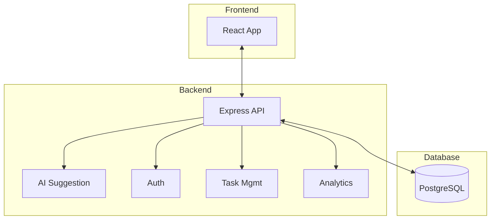

# SprintSync

## Quick Links
- 🎥 [Video Walkthrough](https://www.loom.com/share/249d184a6b4c48248d4ee92146d10283)
- 📝 [API Docs (Swagger)](https://gal-sprint-sync-production.up.railway.app/api/docs/)
- 🌐 [Live Website](https://sprintsync.up.railway.app/)

## Overview
SprintSync is a full-stack web application designed to streamline team productivity through collaborative task management, analytics, and AI-powered features. It provides a modern Kanban board, user authentication, admin controls, and insightful analytics, making it ideal for agile teams and project tracking.

## Key Features
- User authentication and registration
- Kanban-style task board with drag-and-drop
- Task creation, editing, and deletion
- AI-powered task description suggestions
- User and admin roles with protected routes
- Analytics dashboard and top users view
- Responsive, modern UI (Material UI)
- API documentation (Swagger)
- Dockerized for easy local setup

## Architecture
SprintSync is composed of three main services:
- **Frontend**: React + Vite + TypeScript (Material UI)
- **Backend**: Express.js + TypeScript + Prisma ORM
- **Database**: PostgreSQL

All services are orchestrated via Docker Compose for seamless local development. The backend exposes a REST API consumed by the frontend, and both interact with a shared PostgreSQL database. Prisma Studio is included for database inspection.



## Local Setup (Quick Start)
The fastest way to run SprintSync locally is with Docker Compose. This will start the frontend, backend, database, and Prisma Studio in one command.

### Prerequisites
- [Docker](https://www.docker.com/get-started) installed

### Steps
1. **Clone the repository:**
   ```sh
   git clone https://github.com/sh4t4d33p/gal-sprint-sync.git
   cd gal-sprint-sync
   ```
2. **Start all services:**
   ```sh
   docker-compose up --build
   ```
   - Frontend: [http://localhost:3001](http://localhost:3001)
   - Backend API: [http://localhost:3000](http://localhost:3000)
   - Prisma Studio: [http://localhost:5555](http://localhost:5555)
   - PostgreSQL: [localhost:5432](localhost:5432)

3. **Login/Register:**
   - Open the frontend in your browser and register a new user to get started.

**How to Make a User an Admin:**
- Register as a normal user via the website.
- Open [Prisma Studio](http://localhost:5555) in your browser.
- Find your user in the `User` table and set the `isAdmin` flag to `true`.
- Logout of the website and log back in for admin privileges to take effect.

> For advanced setup, environment variables, and manual (non-Docker) instructions, see the [backend/README.md](./backend/README.md) and [frontend/README.md](./frontend/README.md).

## Directory Structure
- `backend/` – Express API, business logic, database models, and tests
- `frontend/` – React app, UI components, and tests
- `docker-compose.yml` – Multi-service orchestration
- `estimates.csv` – (If present) Project estimation/tracking

## License
MIT
