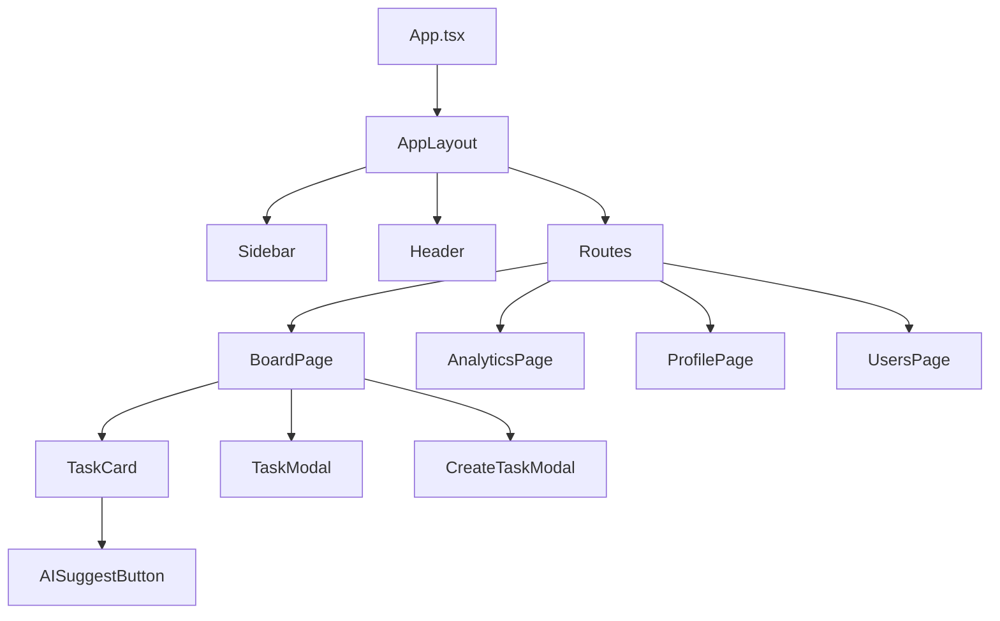

# SprintSync Frontend

## Overview
This folder contains the frontend for the SprintSync application. It is built with React, Vite, TypeScript, and Material UI. The frontend provides a modern, responsive UI for authentication, task management, analytics, and admin features, and interacts with the backend API.

---

## Features
- User authentication (login/register)
- Task board with drag-and-drop (Kanban)
- Task creation, editing, and deletion
- AI-powered task description suggestions
- Analytics and top users (admin)
- Responsive design with Material UI
- Protected/admin-only routes
- API integration with backend
- Docker support

---

## Installation & Setup

### 1. Clone the Repository
```sh
git clone https://github.com/sh4t4d33p/gal-sprint-sync.git
cd frontend
```

### 2. Install Dependencies
```sh
npm install
```

### 3. Environment Variables
Create a `.env` file in the frontend folder:
```env
VITE_API_BASE_URL=http://localhost:3000
```

---

## Running the Frontend

### **Locally (without Docker):**
```sh
npm run dev
```
- The app will be available at `http://localhost:5173` (or as shown in the terminal).

### **With Docker (standalone):**
```sh
docker build -t sprint-frontend .
docker run --rm -p 3001:80 sprint-frontend
```
- The app will be available at `http://localhost:3001`.

### **With Docker Compose (recommended):**
From the project root:
```sh
docker-compose up --build
```
- The frontend will be available at `http://localhost:3001`.

---

## Architecture Diagram



---

## Routing & Component Interaction

- **App.tsx**: Sets up routing and context providers.
- **AppLayout**: Main layout with sidebar, header, and content area.
- **Routes**:
  - `/` → BoardPage (task board)
  - `/analytics` → AnalyticsPage
  - `/profile` → ProfilePage
  - `/users` → UsersPage (admin only)
  - `/top-users` → TopUsersPage (admin only)
  - `/login` → AuthPage (login/register)
- **BoardPage**: Shows Kanban board, uses TaskCard, TaskModal, CreateTaskModal.
- **TaskCard**: Displays task info, allows edit/delete, drag-and-drop, AI suggest.
- **TaskModal**: Edit task details, status, assignment (admin).
- **CreateTaskModal**: Create new task.
- **AISuggestButton**: Calls backend AI endpoint for suggestions.
- **UserContext**: Manages auth state and user info.
- **ProtectedRoute**: Restricts access to authenticated users/admins.

---

## API Integration
- All API calls are made via `src/utils/api.ts`.
- The base URL is set by `VITE_API_BASE_URL`.
- Handles authentication, tasks, analytics, and AI endpoints.

---

## Testing
- Run unit tests:
```sh
npm test
```

---

## License
MIT
